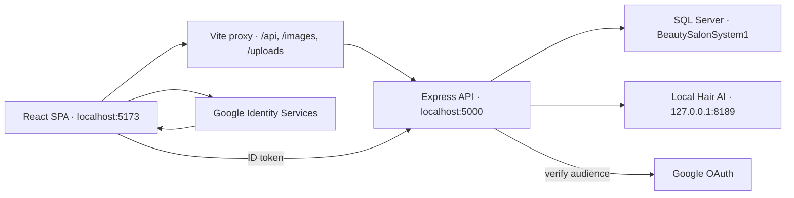

# Mapping và hợp đồng hệ thống Demo Salon Spa

Tài liệu này là bản đồ chuẩn của toàn dự án. Giá trị máy đọc được nằm tại [`config/system.contract.json`](../config/system.contract.json); launcher kiểm tra đồng bộ tự động trước mỗi lần chạy.

## Kiến trúc và luồng dữ liệu



Người dùng truy cập frontend tại `http://localhost:5173`. Vite chuyển tiếp các đường dẫn `/api`, `/images` và `/uploads` sang backend `http://localhost:5000`; AI Worker dùng loopback riêng và không được public trực tiếp.

## Giá trị chuẩn

| Thành phần | Giá trị chuẩn |
|---|---|
| Website | `http://localhost:5173` |
| Backend | `http://localhost:5000` |
| API base path | `/api` |
| Health | `/api/health` |
| AI Worker | `http://127.0.0.1:8189` |
| SQL Server | `localhost:1433` |
| Frontend port | `5173` |
| Launcher | `salon.cmd` |

Không dùng `127.0.0.1:5173` làm URL người dùng vì Google OAuth kiểm tra origin chính xác. Các kết nối nội bộ/health vẫn có thể dùng loopback IP.

## Mapping vai trò

| Role database | Nhóm | UI chính | Phạm vi |
|---|---|---|---|
| `ADMIN` | Internal/Admin | `/admin/*` | Toàn hệ thống, báo cáo, cấu hình, audit |
| `MANAGER` | Internal/Manager | `/admin/*` giới hạn RBAC | Chi nhánh, nhân sự, vận hành |
| `RECEPTIONIST` | Internal/Staff | `/receptionist/*` | Lịch hẹn, khách hàng, hóa đơn |
| `TECHNICIAN` | Internal/Staff | `/technician/*` | Lịch làm, dịch vụ, treatment notes |
| `CUSTOMER` | External | `/customer/*` | Hồ sơ và dữ liệu cá nhân |
| `GUEST` | External, không lưu DB | Public routes | Chỉ nội dung công khai |

`STYLIST` là alias nghiệp vụ của `TECHNICIAN`; `STAFF` là nhóm phân tích gồm `RECEPTIONIST` và `TECHNICIAN`, không phải role database độc lập.

## Mapping chức năng UI → API → dữ liệu

| Miền chức năng | UI | API | Bảng dữ liệu chính |
|---|---|---|---|
| Xác thực | `/login`, `/register` | `/api/auth` | `Users`, `PendingUsers`, `Roles`, `Customers` |
| Google Sign-In | Login/Register | `/api/auth/google-login` | `Users.GoogleId`, `Customers` |
| Danh mục dịch vụ | `/services`, `/packages` | `/api/services`, `/api/packages` | `ServiceCategories`, `Services`, `Packages`, `PackageServices` |
| Đặt lịch | `/customer/booking`, appointments | `/api/appointments` | `Appointments`, `AppointmentServices`, `WorkShifts`, `EmployeeServices` |
| Điều phối | `/receptionist/*` | `/api/receptionist`, `/api/waiting-list` | `WaitingList`, `Appointments`, `Employees`, `Branches` |
| Thanh toán | Payment pages | `/api/payments` | `Invoices`, `Payments`, `Refunds` |
| Khuyến mãi | Promotions/Vouchers | `/api/vouchers`, admin promotion APIs | `Promotions`, `Vouchers`, `CustomerVouchers` |
| Thành viên | Membership/points | `/api/membership` | `MembershipLevels`, `LoyaltyPointTransactions`, `Customers` |
| AI tư vấn | `/customer/ai` | `/api/ai` | `AIChatLogs`, `AIRecommendations`, `AIAuditLogs` |
| AI Stylist | `/customer/stylist-advisor` | `/api/ai/stylist/*` | `AIHairStyles`, lịch sử thử tóc, private image storage |
| AI da | `/customer/skin-analyzer` | `/api/ai/skin/analyze` | Dữ liệu phân tích da và audit AI |
| Báo cáo nội bộ | `/admin/reports` | `/api/internal-analytics`, `/api/admin/reports` | Orders/appointments, invoices, payments, employees, logs |
| Chăm sóc sau dịch vụ | Reviews/Feedback | `/api/admin/reviews`, `/api/admin/feedbacks` | `Reviews`, `ReviewImages`, `Feedbacks` |
| Treatment notes | Technician pages | `/api/v2/treatment-notes` | `TreatmentNotes`, `TreatmentNoteAttachments` |

## Mapping Google OAuth

| Layer | Biến |
|---|---|
| Frontend Client ID | `VITE_GOOGLE_CLIENT_ID` |
| Backend audience | `GOOGLE_CLIENT_ID` |
| Frontend origin allowlist | `VITE_GOOGLE_AUTHORIZED_ORIGINS` |
| Backend origin mapping | `GOOGLE_AUTHORIZED_ORIGINS` |

Bốn giá trị phải đồng bộ với OAuth Web Client trong Google Cloud. Với local production, Authorized JavaScript origin bắt buộc là:

```text
http://localhost:5173
```

Khi public bằng Tailscale/domain khác, thêm origin HTTPS chính xác vào cả hai file `.env` và Google Cloud Console trước khi chạy `salon.cmd public`.

## Quy mô mapping hiện tại

- 85 route frontend.
- 36 API mount point backend.
- 45 bảng SQL duy nhất trong schema gốc, chưa tính bảng được tạo bởi migration.
- Một nguồn cấu hình runtime máy đọc được: `config/system.contract.json`.
- Một preflight: `deploy/preflight.ps1`.

## Quy tắc đồng bộ

1. Thay đổi port/origin/role/API gốc phải cập nhật `config/system.contract.json` trước.
2. Không tạo role `STYLIST` hoặc `STAFF` trong DB; dùng alias/group mapping.
3. Google Client ID frontend và backend phải giống tuyệt đối.
4. API domain record giữ tên trường theo schema hiện hữu; response mới dùng envelope `{ success, message, data }`, ngoại trừ auth trả `{ message, token, user }`.
5. Guest/Customer không được truy cập `/api/internal-analytics` hoặc báo cáo nội bộ.
6. Mọi thay đổi schema phải đi qua migration và ghi `SchemaMigrationHistory`.
7. Chạy `salon.cmd` để preflight tự phát hiện cấu hình lệch trước khi mở dịch vụ.
