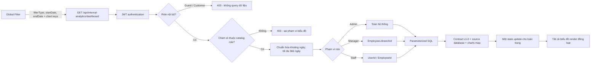

# Báo cáo nội bộ & bộ lọc biểu đồ tương tác

## 1. Ma trận biểu đồ theo vai trò

| Vai trò | Phạm vi dữ liệu | Biểu đồ mặc định | Quyền xuất |
| --- | --- | --- | --- |
| Admin | Toàn hệ thống | Nhịp doanh thu; Lợi nhuận & chi phí; Người dùng active; Hiệu suất chi nhánh; Nhật ký hệ thống | PDF, Excel |
| Manager | Chỉ chi nhánh gắn với hồ sơ `Employees.BranchId` | Doanh số chi nhánh; KPI đội nhóm; Tiến độ công việc | Không |
| Staff và role nội bộ mở rộng | Chỉ `UserId` / `EmployeeId` của tài khoản đăng nhập | KPI cá nhân; Tiến độ cá nhân; Nhịp thao tác cá nhân | Không |
| Customer / Guest | Không có | Không có | Không |

`TECHNICIAN`, `RECEPTIONIST`, `STYLIST` và các role nội bộ khác được xếp vào nhóm Staff. `CUSTOMER` và `GUEST` luôn bị từ chối tại middleware trước khi service thực hiện query.

## 2. Phân luồng dữ liệu



## 3. UI/UX wireframe

```text
┌────────────────────────────────────────────────────────────────────┐
│ PHẠM VI QUẢN LÝ                         ● Theo chi nhánh            │
│ Hiệu suất chi nhánh & đội nhóm                                    │
│ Dữ liệu chỉ thuộc phạm vi của tài khoản đang đăng nhập.            │
├────────────────────────────────────────────────────────────────────┤
│ ● KHOẢNG PHÂN TÍCH   [◷ 30 ngày qua] [↻ Đồng bộ lại]   SQL Server │
├─────────────────────────────────┬──────────────────────────────────┤
│ ĐỒNG BỘ TOÀN TRANG · 30 NGÀY    │ ĐỒNG BỘ TOÀN TRANG · 30 NGÀY   │
│ Doanh số chi nhánh              │ KPI đội nhóm                    │
│ Mô tả phạm vi dữ liệu            │ Mô tả phạm vi dữ liệu           │
│                                  │                                  │
│        ╭──╮       ╭────╮         │  ███                             │
│   ╭────╯  ╰───────╯    ╰──       │  ███  ██   ██                    │
│                                  │  ███  ██   ██  █                 │
└─────────────────────────────────┴──────────────────────────────────┘
│ ĐỒNG BỘ TOÀN TRANG · 30 NGÀY                                      │
│ Tiến độ công việc                                                   │
│       ◜████◝     ● Hoàn thành  18                                  │
│       █    █     ● Đang làm      4                                  │
│       ◟████◞     ● Chờ xử lý     2                                  │
└────────────────────────────────────────────────────────────────────┘
```

Khi người dùng mở control `◷`, popover tùy biến hiển thị ba nhóm preset Ngày/Tháng/Năm và lịch chọn khoảng ngày. Một thay đổi tạo đúng một request dashboard; mọi biểu đồ cùng chuyển sang skeleton và nhận chung `range`, `generatedAt`, `scope` trong một payload.

## 4. API contract

### Catalog theo role

`GET /api/internal-analytics/catalog`

Trả về `scope` và danh sách chart đã lọc theo JWT role. Frontend không tự quyết định quyền.

### Dữ liệu đồng bộ toàn trang

`GET /api/internal-analytics/dashboard`

Tham số `keys` là danh sách chart key cách nhau bằng dấu phẩy. Backend kiểm tra toàn bộ key theo role trước khi chạy SQL. Nếu bỏ `keys`, API dùng catalog mặc định của role.

Endpoint một widget vẫn được giữ cho xuất báo cáo hoặc tích hợp riêng:

`GET /api/internal-analytics/charts/:chartKey`

Query parameters:

| Tham số | Giá trị |
| --- | --- |
| `filterType` | `today`, `yesterday`, `last7Days`, `last30Days`, `thisMonth`, `lastMonth`, `customMonth`, `thisYear`, `year`, `custom` |
| `month` | `YYYY-MM`, bắt buộc với `customMonth` |
| `year` | `YYYY`, bắt buộc với `year` |
| `startDate` | `YYYY-MM-DD`, bắt buộc với `custom` |
| `endDate` | `YYYY-MM-DD`, bắt buộc với `custom` |

Ví dụ response:

```json
{
  "success": true,
  "data": {
    "schemaVersion": "1.0",
    "source": "database",
    "generatedAt": "2026-07-22T08:30:00.000Z",
    "range": {
      "filterType": "last7Days",
      "startDate": "2026-07-16",
      "endDate": "2026-07-22",
      "granularity": "day",
      "timeZone": "Asia/Ho_Chi_Minh"
    },
    "scope": { "type": "manager", "branchId": 2 },
    "charts": {
      "departmentSales": {
        "schemaVersion": "1.0",
        "source": "database",
        "chart": { "key": "departmentSales", "type": "area" },
        "data": {
          "series": [
            {
              "id": "point-1",
              "label": "2026-07-22",
              "value": 12500000,
              "metrics": { "revenue": 12500000 }
            }
          ],
          "totals": { "primary": 12500000 }
        }
      }
    }
  }
}
```

`source: "database"` là điều kiện bắt buộc ở frontend. Payload thiếu nguồn hoặc phiên bản schema bị coi là lỗi; giao diện không dùng dữ liệu fallback/mock.

### Đồng bộ dữ liệu database

Migration `database/migrations/support_global_internal_analytics.sql`:

- gán `Employees.BranchId` cho Manager chưa cấu hình;
- backfill `Appointments.BranchId` từ phòng phục vụ hoặc nhân viên;
- hoàn thiện `Payments.PaidAt`, loại system log và hoa hồng còn thiếu;
- bổ sung index cho truy vấn theo ngày, chi nhánh, nhân viên và trạng thái;
- ghi một audit log idempotent, không tạo lịch hẹn hay doanh thu giả.

### Xuất báo cáo (Admin only)

- `GET /api/internal-analytics/charts/:chartKey/export?format=pdf&...`
- `GET /api/internal-analytics/charts/:chartKey/export?format=excel&...`

Mọi filter và kiểm tra quyền được áp dụng lại ở backend khi xuất file.
